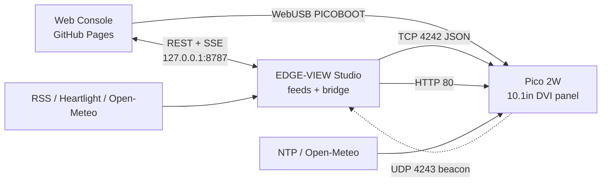

# IO-nity EDGE-VIEW

**Raspberry Pi Pico 2W + Waveshare 10.1" DVI display, driven from a server over WiFi.**

The Pico is a *renderer*, not the brain. EDGE-VIEW Studio (a Windows app) fetches
the clock, weather, scripture and AI headlines, then streams them as key/value
data into named screen slots. The layout itself is interchangeable at runtime —
any panel can be moved to any slot over the wire, with no reflash. If the server
goes away, the device falls back to what it can work out on its own.



## Three ways in

| Surface | What it is | Where |
|---|---|---|
| **Web Console** | Browser control surface: reset, reflash over USB, live WiFi stream, scene editor, AI | [`docs/app/`](docs/app) → GitHub Pages `/app/` |
| **EDGE-VIEW Studio** | The server. Toolchain installer, feed scheduler, device control, message board, bridge | [`StationPicoInstaller/`](StationPicoInstaller) |
| **Device HTTP** | The Pico's own page and message board, QR-linked from the screen | `http://<pico-ip>/` |

## Hardware

| Component | Details |
|-----------|---------|
| **MCU** | Raspberry Pi Pico 2W (RP2350, dual Cortex-M33) |
| **Display** | Waveshare 10.1" IPS LCD with DVI input (PICO-DVI-10.1") |
| **Video** | DVI via PIO TMDS, 640×480p60, 3-bit RGB (8 colours) |
| **WiFi** | CYW43439 (2.4 GHz, on the Pico 2W) |
| **Power** | Pico via micro-USB; display board via USB-C (5 V / 2 A+) |

### Wiring

| Pico GPIO | Signal |
|-----------|--------|
| GPIO 8 | DVI clock |
| GPIO 10 | TMDS D0 (blue) |
| GPIO 12 | TMDS D1 (green) |
| GPIO 14 | TMDS D2 (red) |

## Apps

| Target | Description |
|--------|-------------|
| `edgeview` | The flagship: server-driven scene engine, WiFi, NTP, weather, games, verse, QR, news |
| `demo_colors` | Cycles the 8 display colours |
| `demo_bounce` | 12 animated balls |
| `demo_sysinfo` | Hardware specs and diagnostics |
| `demo_rainbow` | Animated gradient sweep |
| `gui_demo` | Waveshare drawing primitives |
| `hello_dvi` | Scrolling test pattern |

## Scene engine

Ten fixed slots, sixteen panels, bound at runtime:

**Slots** `header` `info_a` `info_b` `info_c` `stage` `side` `marquee` `ticker` `stats` `footer`

**Panels** `header` `clock` `network` `feed` `weather` `game` `verse` `qr` `rotate` `text` `logo` `marquee` `news` `stats` `footer` `blank`

```json
{"type":"layout","slot":"stage","panel":"clock"}
{"type":"data","key":"hdr.title","value":"IO-NITY EDGE-VIEW"}
{"type":"query","what":"layout"}
{"type":"wifi","ssid":"NewNetwork","pass":"secret"}
```

Values go stale after five minutes, at which point each panel falls back to its
local source. Full command list in [Stream Protocol](docs/wiki/Stream-Protocol.md).

## Quick start

### Prerequisites

Windows 10/11 · Git · CMake 3.12+ · Ninja · Visual Studio Build Tools 2022 (host tools).
The ARM GCC toolchain and Pico SDK are downloaded for you.

### Setup, build, flash

```powershell
.\StationPico.ps1 -Action setup                       # one-time: SDK + toolchain
.\StationPico.ps1 -Action build -Target edgeview
.\StationPico.ps1 -Action buildflash -Target edgeview
.\StationPico.ps1 -Action status
```

Or skip the shell entirely: hold **BOOTSEL**, plug the Pico in, open the web
console and press **Flash over USB**. It speaks PICOBOOT straight from Chrome.

### Enter BOOTSEL

Hold **BOOTSEL**, press and release **RESET**, release BOOTSEL. The board
appears as a drive named `RP2350`.

## Build system

CMake + Ninja against Pico SDK 2.1.1.

- `StationPico.ps1` — menu, setup, build, flash, status
- `build_native.bat` — low-level CMake build (MSVC + ARM GCC)
- `build.ps1` — PowerShell equivalent with extra options
- `flash.bat` — build + flash wrapper
- `rebuild.bat` — clean rebuild of `edgeview`
- `setup.bat` / `setup.ps1` — first-time dependency install

CI builds every target on push and publishes the UF2s to GitHub Pages, so the
web console can always flash the latest `master`.

## Layout

```
libionity/          SDK-Ionity
├── ionity_wifi     provisioning, saved credentials, remote reprovisioning
├── ionity_stream   TCP 4242 command server
├── ionity_data     server-streamed key/value store (32 slots, 5 min staleness)
├── ionity_scene    slot/panel registry — the interchangeable layer
├── ionity_http     HTTP 80 page + message board
├── ionity_pixels   drawing helpers
└── ionity_brand    header, footer, panel chrome

libdvi/             DVI/TMDS encoding (PIO)
libgui/             Waveshare drawing primitives
libsprite/          sprite rendering

apps/edgeview/      the flagship app
StationPicoInstaller/  EDGE-VIEW Studio (.NET MAUI) — the server
docs/app/           the web console
server_app/         deprecated Python bridge, superseded by Studio
```

## WiFi

Compiled in at build time, or provisioned on screen at first boot, or pushed
remotely from Studio / the console:

```cmake
target_compile_definitions(libionity INTERFACE
    IONITY_WIFI_SSID="YourSSID"
    IONITY_WIFI_PASS="YourPassword"
    IONITY_STREAM_PORT=4242
)
```

## Not supported

**Brightness.** The panel drives its own backlight over DVI and the framebuffer
is 3-bit RGB — eight colours, no intermediate levels. There is nothing to dim in
software. Use the monitor's controls.

## Licence

Code: MIT — see [LICENSE](LICENSE).
Trademarks, third-party components and data sources: see [NOTICE](NOTICE).

Ionity Global (Pty) Ltd is not affiliated with IONITY GmbH, the European EV
charging network.
