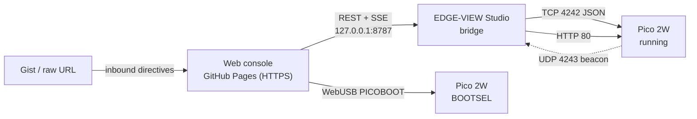

# Web Console

A browser control surface for EDGE-VIEW, served from GitHub Pages at
`/app/`. It resets and reflashes the device, shows the live WiFi stream,
rearranges the scene and runs the console-side AI.

## What talks to what



The console is **only a control surface**. Studio is the server: it fetches the
verse, headlines, weather and time and streams them into the display. Close
Studio and the glass falls back to what it can work out on its own.

## Why a bridge is needed

A browser cannot open a raw TCP socket, and a page served over HTTPS is not
allowed to fetch `http://192.168.x.x`. Loopback is the exception — Chromium
treats `http://127.0.0.1` as a trustworthy origin — so the console reaches the
device through Studio.

## Pairing

1. Studio → **Control** → turn on **Web Console Bridge**.
2. Copy the pairing token.
3. Paste it into the console's **Server** card and press **Pair**.

The bridge refuses any request without that token, and only answers
allow-listed origins. Without both, any page you happened to visit could
reflash your hardware.

## Flashing from the browser

| Method | Needs | Notes |
|---|---|---|
| **Flash over USB** | Chrome/Edge, board in BOOTSEL | Speaks PICOBOOT directly: erase, write, reboot |
| **Copy to RPI-RP2** | Chrome/Edge | Picks the bootloader volume and copies the UF2 |
| **Download UF2** | any browser | Drag it onto the drive yourself |
| **Reboot to BOOTSEL** | WebSerial | 1200-baud touch; only if the firmware exposes USB stdio |

Builds come from the `Pages` workflow, which compiles every target and
publishes the UF2s next to the site with a `firmware/manifest.json`. No login
needed to flash the latest `master` build.

## Live stream box

Every line the bridge sends or receives is relayed over SSE and rendered with
its direction. Filter by substring, toggle `tx`/`rx`/`log`, and send raw JSON
straight down the same pipe.

## Chat crawl

The bar pinned to the bottom scrolls right to left. Lines come from the server —
the device message board, anything the AI announces, and whatever anyone types
into the console. The console never invents them.

## Ionity AI

Runs entirely in the page. No keys, no round trips.

- **Intent parsing** — "put the big clock in the middle", "blank the ticker",
  "switch to night scene", "say hello Centurion" become real commands.
- **Scenes** — eight composed layouts (Focus, News wall, Kiosk, Reflect, Ops,
  Night, Showcase, Default). Autopilot picks one from the hour of the day.
- **Sentinel** — scores the link from error rate, silence and feed state. Below
  50% it applies the repair itself: restart feeds, re-push content, wait for a
  fresh discovery beacon.
- **Curator** — weights headlines by topic, taxes clickbait and drops
  near-duplicates by token overlap before they reach the glass.

### Inbound directives (Gist)

Point the console at a public Gist and it pulls a JSON document, optionally
every 60 seconds:

```json
{
  "title": "OPEN DAY",
  "scene": "kiosk",
  "layout": { "stage": "qr", "side": "text" },
  "data": { "text.title": "WELCOME", "text.body": "Ask us anything." },
  "news": ["headline one", "headline two"],
  "chat": ["Doors open at 09:00"],
  "mode": "off"
}
```

Unknown fields are ignored, keys and panel names are validated against the
firmware's own lists, and only `github.com` / `githubusercontent.com` hosts are
accepted — the document is untrusted input.

## Running it locally

```powershell
cd docs
python -m http.server 8080
# http://localhost:8080/app/
```

Add `http://localhost:8080` to the bridge's allowed origins (it is there by
default).
